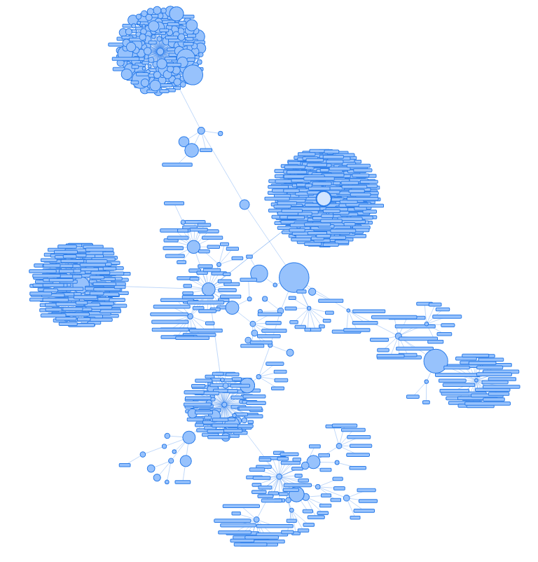

# Flask-VisJS


[](https://pypi.org/project/Flask-VisJS/)
[](https://github.com/dadav/Flask-VisJS/actions/)
[](https://codecov.io/gh/dadav/Flask-VisJS)



Flask-VisJS is a simple wrapper for the famous visjs java library. It helps you to integrate
the library into your flask app.

## Installation

```bash
pip install Flask-VisJS
```

## Configuration

Please use [https://flask-visjs.readthedocs.io/en/latest/](https://flask-visjs.readthedocs.io/en/latest/)

Work in progress...

## Example

```python
from flask import Flask, render_template_string
from flask_visjs import VisJS4, Network

app = Flask(__name__)
VisJS4().init_app(app)

@app.route('/')
def index():
    net = Network("500px", "500px")
    net.add_node(0, label="Node 0")
    net.add_node(1, label="Node 1")
    net.add_edge(0, 1)
    return render_template_string("""
<html>
    <head>
      {{ net.inject_css() }}
    </head>
    <body>
      {{ net.inject_js() }}
      {{ net.inject_graph() }}
    </body>
</html>
""", net=net)
```

[Go to the example folder](./examples/)
